# Semester Project Requirements

## Submission at the End of the Semester

### Common Requirements:
- **Select appropriate technology and language:** Java/SpringBoot, Java, C#, etc. (mandatory)
  - *SpringBoot (Backend)*
- **README in Git with a description of what is completed and where the functionality is located** (mandatory)
  - *Completed*
- **Use a common database (relational or graph-based)** (mandatory)
  - *PostgreSQL*
  - *Prod: docker container on EC2 instance*
  - *Dev*: vz. docker-compose.yml 
- **Utilize cache (e.g., Hazelcast)** (optional)
  - *Hazelcast*
  - *Spring Cache Annotations in user-service, product-service and order-service on the Service Layer*
  - *Dev: application-docker.yml*
  - *Prod: application-production.yml*
- **Use messaging principles (Kafka or JMS)** (optional)
  - *Kafka*
  - *Dev: vz. docker-compose.yml*
  - *Prod: EC2 instance with Kafka broker and Zookeeper in docker containers*
- **The application must be secured with either basic authorization or OAuth2** (optional)
  - *JWT Token with ADMIN-USER roles: config/ package in auth-service, user-service, product-servivce, order-service*
- **Use of interceptors (at least one class), e.g., for logging (log the incoming request)** (optional)
  - *Api-Gateway: logging incoming requests*
- **Use one of the following technologies: SOAP, REST, GraphQL, Java RMI, Corba, XML-RPC** (optional)
  - *REST*
- **Deploy on a production server, e.g., Heroku** (mandatory)
  - *AWS EC2 instances: vz Deployment Diagram*
- **Select appropriate architecture (event-based, pipe and filter, etc.)** (mandatory)
  - *event-based: Product-Service, Order-Service, Notification-Service*
- **Initialization procedure (how to deploy the application, where the basic data for a new DB like admin are located)** (mandatory)
  - *Completed*
- **Utilize Elasticsearch** (optional)
  - *Using ELK stack*
  - *Dev: logstash-docker/ dir with logstash.conf for each microservice; Elasticsearch, Kibana and Logstash running in docker containers - vz docker-compose file
- **Use at least 5 design patterns (must make sense)** (mandatory)
  - *DAO*
  - *Singleton: in main classes of microservices - reusing objects*
  - *DTO, LDO in between Presentation, Business and Data Access Layers*
  - *Builder - Spring Annotation - mapper/ in product-service *
  - Interceptor - in api-gateway
- **For each team member, provide 2 use cases (to ensure the software is not trivial)** (mandatory)
  - *Completed*

### Bonus Points:
- **Cloud services (Azure, AWS)** +2 points
  - *AWS EC2 for deploying*

### Also:
- **Tests**
  - *JUnit tests for user-service, order-service and product-service*
- **Actuator**
  - *vz. application.yml in all microservices* 
- **Docker, Docker-compose**
- **Eureka Discovery Server**
  - vz. discovery-service
- **Different Environments**
  - *Dev, Prod*
  - vz. application-docker.yml and application-production.yml

### What is not working:
- **Flyway**
  - *Does not work for common database*
  - *User-service succsessfully mirgates, but others do not*


## AS-IS 

The current state of operations at the tire service shop involves a predominantly manual and direct interaction-based approach to customer service and appointment scheduling. The shop, managed by the owner and supported by a dedicated team of three employees, specializes in tire mounting services and customer support. Customers looking to utilize the shop's services or purchase items must initiate contact through a phone call to the owner. Following this initial contact, the process requires customers to physically visit the shop's reception area, where transactions are completed using either cash or card payments at the register.

This traditional service model, while straightforward, presents several limitations in terms of accessibility, convenience, and efficiency, both for the shop's management and its clientele. The lack of digital infrastructure for booking and sales has rendered the shop less competitive in an increasingly digital marketplace. The shop's reliance on in-person interactions and cash/card payments at a physical location may deter potential customers seeking more flexible and contactless options. Consequently, this approach to business operations has impacted the shop's popularity and ability to thrive amidst competitive pressures in the tire service industry. Recognizing these challenges, the owner is now considering the development of a website aimed at digitalizing the booking and purchasing processes, with the goal of enhancing customer convenience, expanding service accessibility, and ultimately improving the shop's market position.

## TO-BE State
The envisioned future state of the tire service shop introduces a hybrid model, seamlessly integrating digital and physical customer service channels. The core of this transformation is the adoption of a website that facilitates online booking for services and ordering of items. This digital platform aims to enrich the customer experience by offering a comprehensive catalog of items available in stock, enabling customers to place orders directly through the website. Upon ordering, customers will receive SMS updates regarding the status of their order, from confirmation through to delivery.

Despite the shift towards digitalization, the tire service shop will retain its traditional, in-person service at the reception for those customers who prefer or require physical interaction. When services or items are booked or ordered in person at the shop, customers will be provided with an order ID. This ID can then be used to track the order status or service booking details directly on the website, offering a blend of digital convenience with the assurance of physical customer service.

To support the new online ordering system, the shop will engage a delivery service, ensuring that the digitalization of sales extends beyond the point of purchase to include the delivery of items directly to the customer. This addition aims to streamline the purchasing process, making it more efficient and customer-friendly.

This future state represents a strategic move towards digital transformation, aiming to enhance operational efficiency, improve customer satisfaction, and strengthen the shop's competitive position in the market. By offering both online and in-person services, the tire service shop aims to cater to a broader customer base, accommodating varying preferences for how services and purchases are made and managed.


## Analýza SWOT

**Strengths (What the shop does well):**

- Expert Team: Having a skilled team means the shop can provide high-quality tire services that customers can trust.
- New Website: The new digital booking and purchasing system will make it easier for customers to use the services.
- Customer Service: A strong focus on customer satisfaction can set the shop apart from competitors.

**Weaknesses (What the shop could improve on):**

- Limited Digital Presence: Starting from scratch with online marketing and sales might be challenging and could require time to build up.
- Dependence on Physical Location
- Resource Constraints

**Opportunities (External factors the shop could take advantage of):**

- Market Growth: An increasing number of people looking for convenient tire services online is a big opportunity.
- Technology Advancements: Using new technologies can improve services (like mobile apps for booking) and attract more customers.
- Partnerships: Collaborating with other businesses, like auto repair shops or car dealerships, could bring in more customers.

**Threats (External challenges the shop might face):**

- Competition
- Economic Downturns: When people have less money to spend, they might delay or skip tire services, affecting sales.
- Supplier Issues

## Analýza 5F
1. **Threat of New Entrants:**
- Open-source technologies
- Requirements for operating in the automotive service industry 

2. **Threat of Substitute Products or Services:**
- The presence of other vehicle maintenance services
- The extent to which customers value specialized tire services over general automotive services.
3. **Bargaining Power of Customers:**
- Customers' sensitivity to pricing changes, especially if comparable services are offered at lower prices by competitors.
4. **Bargaining Power of Suppliers:**
- Dependence on a limited number of tire manufacturers or suppliers could increase their bargaining power.
- The ease with which the shop can switch to different brands or suppliers affects their bargaining position.
5. **Competitive Rivalry:**
- Number and Capability of Competitors: The intensity of competition among existing tire service shops and automotive service providers.
- Service Differentiation: The shop's ability to differentiate its services and online experience from those of competitors.

## Analýza PEST(E)
**Political:**
- Regulatory Compliance: Adherence to online business regulations, data protection laws, and consumer rights when selling online.
- Trade Policies: Impact of local and international trade policies on the procurement of tire stock and parts, which could affect pricing.

**Economic:**
- Market Competition: The economic landscape of the tire service industry, including competition and market demand.
- Economic Trends: Influence of local and global economic trends on consumer spending habits, especially in automotive services and products.
- Access to Funding: Availability of investments or loans for small businesses to invest in digital infrastructure.

**Social:**
- Customer Expectations: Growing consumer preference for online shopping and digital service bookings.
- Demographic Trends: Identifying target demographics that are most likely to use digital platforms for automotive services.
- Digital Literacy: The level of digital literacy among the target customer base, influencing the adoption and effective use of the new website.

**Technological:**
- E-commerce Platforms: The availability and selection of e-commerce platforms suitable for automotive services and product sales.
- Cybersecurity Measures: Ensuring the website is secure and protects customer data, building trust in the digital platform.
- Technological Integration: Ability to integrate new digital services with existing in-shop processes and systems for seamless operations.

**Legal:**
- Online Business Laws: Compliance with laws governing online businesses, including sales tax, digital marketing, and consumer rights.
- Data Protection Regulations: Adherence to data protection laws like GDPR (for European customers) or local data protection laws.

**Environmental**:
- Sustainability Concerns: Incorporating environmentally friendly practices in the delivery and packaging of products sold online.
- Waste Management: Ensuring proper disposal and recycling of old tires and automotive parts, aligning with environmental regulations and customer expectations for sustainability.


## **Functional Requirements**

* The system should notify the user upon changing an order state.
* The platform should support the addition of new pages and content sections to accommodate business growth and user interest.
* Users must register, if they do not have an account, otherwise they can log in.
* Administrators do not need to register - they can log in without registration.
* Administrators CRUD info about a product.
* Administrators can perform also all operations as a Registered user.
* Unregistered user can browse the catalog of available products.
* Registered user can order a product and manipulate its user's info.

## **Non-Functional Requirements**

* It must be capable of handling a high volume of page requests and user actions without degradation in performance.
* The website should be designed with a user-friendly interface, making it easy for users of all technical abilities to navigate and find information.
* Content should be presented in a clear, concise manner, with a consistent layout across all pages.
* The platform must be scalable to accommodate an increasing number of users and data over time without requiring a complete redesign.
* It should support the easy addition of new features and services in response to customer feedback and business needs.
* The system must ensure the security of user data, including personal information and transaction details, adhering to best practices and compliance standards.
* It should include secure access controls for administrators and users.
* The system should guarantee an uptime of 99.9%.


## Use Case Diagram
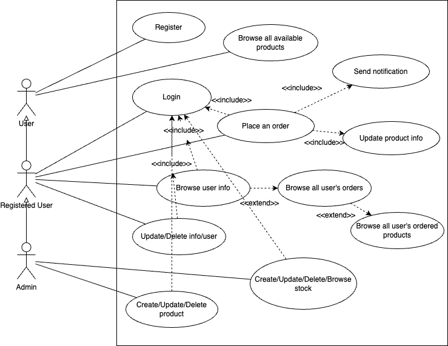


## UML diagrams
- ER Diagrams represents Entities in the System
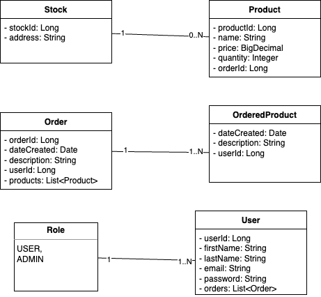
- Sequence Diagram of the products ordering
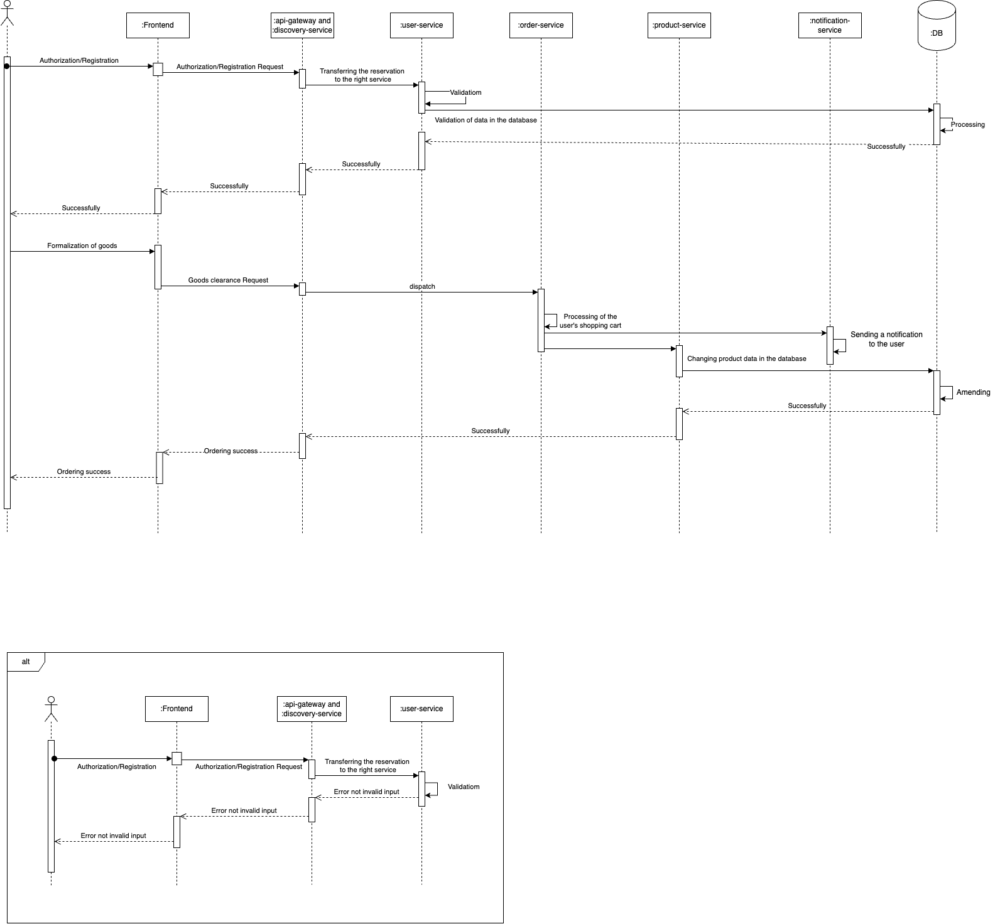

## Architecture
Project has only Backend part.

Backend is separated into microservices:

* User Service - CRUD operations on user
* Auth Service - issuing JWT token, login
* Api Gateway - request routing
* Discovery Service - mircoservices registration
* Order Service - placing order, getting user orders
* Product Service - CRUD operations on stock and product
* Notification Service - sending notifications (just logging)

Microservices communication is implemented by using Event-Driven Architecture and sending sync requests using Feign Client and async using Kafka broker.


## Deployment Diagram
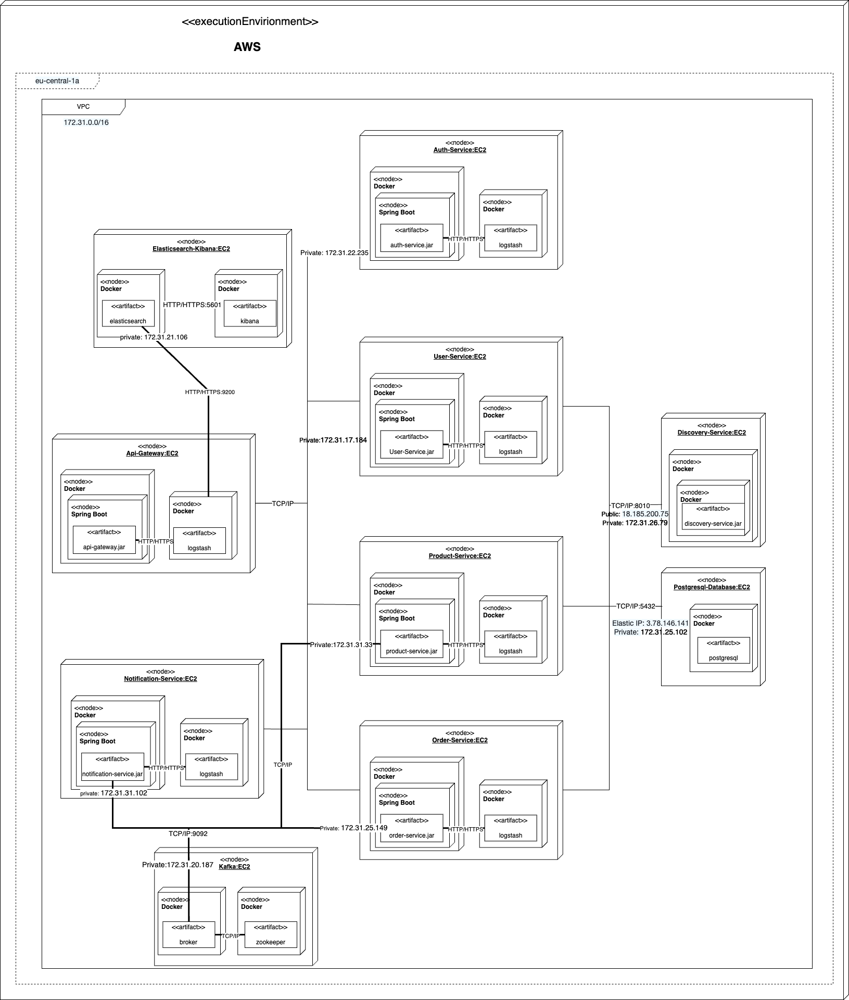

## Component Diagram

## Analysis and selection of solution alternatives
**Own Development** 
Of all the alternatives, this seems to be the least expensive. The company is engaged in creating similar systems, so it has programmers and equipment for the realization of such a project. The problem is only the programmers' workload on other projects, so they would work on the solution between projects if they had nothing else to do. However, this solution will extend the development time and it is not possible to determine exactly when it will be completed. Another advantage is that we can further define the application specification without any financial penalties.

**Ordering from Another Company** 
This option is better than the first one in that we do not have to worry about the development process. Here, it is necessary to specify the requirements more precisely. It is certainly a more expensive development option. The time of completion will probably be shorter, which can be an advantage when the company has other projects to take care of and needs this project completed. In case of any problems, having IT support is an advantage.

**Open-source Solution** 
The open-source solution is the cheapest option of all three. Here, it is most important to choose the right product or products (1 product probably won't be enough). The disadvantages include factors such as the lack of IT support in case of problems. Another problem could be that the product does not meet the specifications or that the solution will be clumsy and will rather lead to delays in work.

## WBS – breakdown of the project into sub-processes
| From-To | Activity |
| ------ | ------ |
|    27.03-01.04    |   Planning     |
|    02.04-05.04    |    Requirement Analysis    |
|    06.04-10.04    |    Design    |
|    11.04-01.05    |    Implementation    |
|    02.05-03.05    |    Testing    |
|    04.03-10.05    |    Deployment    |
|    11.05-inf    |    Maintenance    |

## Resources
### **Human Resources: Team Roles**
- Developer
- Project Manager
- Analyst
- Tester

### **Tools needed for development**
- Spring Boot - backend
- PostgreSQL - database
- Kafka - message broker
- JUnit - testing
- Docker - containerisation
- ELK - Collection logs, transforming, visualization 
- AWS - deployment to the cloud


## Responsibility Matrix

| Milestones | Manager | Analyst | Developer | Tester |
|------------|---------|---------|-----------|--------|
| Planning | R | C | C | C |
| Requirements Analysis | A | R | C | I |
| Design | A | C | R | C |
| Implementation | A | I | R | I |
| Testing | A | I | R | R |
| Deployment | A | C | R | I |
| Maintenance | A | I | R | R |


## GANTT Schedule
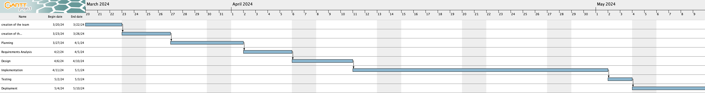


## FMEA Risk Analysis
### **1. Website Downtime**

* **Failure Mode**: The website goes offline or becomes unresponsive.
* **Effects**: Customers can't book services or order products, leading to lost sales and dissatisfaction.
* **Severity**: High, as it directly affects sales and customer experience.
* **Occurrence**: Medium, depending on the reliability of the hosting service.
* **Detection**: High, likely to be noticed quickly.
* **Risk Priority**: High, critical to address with robust hosting and monitoring.

### **2. Payment Gateway Issues**

* **Failure Mode**: Problems with the payment system, such as transaction failures.
* **Effects**: Frustration for customers, incomplete transactions, and potential loss of revenue.
* **Severity**: High, impacts customer trust and financial flow.
* **Occurrence**: Low to medium, depends on the gateway provider's reliability.
* **Detection**: Medium, might not be immediate if issues are intermittent.
* **Risk Priority**: High, requires choosing reliable payment solutions and having support ready.

### **3. Data Security Breach**

* **Failure Mode**: Unauthorized access to customer data.
* **Effects**: Loss of customer trust, legal consequences, and potential financial liabilities.
* **Severity**: Very high, due to the impact on reputation and compliance issues.
* **Occurrence**: Low, if proper security measures are in place.
* **Detection**: Medium to high, can be complex to detect sophisticated breaches.
* **Risk Priority**: Very high, necessitates investing in strong cybersecurity measures.

### **4. Inaccurate Inventory Management**

* **Failure Mode**: The website shows incorrect stock levels for products.
* **Effects**: Orders cannot be fulfilled as promised, leading to customer dissatisfaction and operational inefficiencies.
* **Severity**: Medium to high, affects customer satisfaction and inventory control.
* **Occurrence**: Medium, possible if not integrating real-time inventory tracking.
* **Detection**: Medium, might take time to realize discrepancies.
* **Risk Priority**: High, critical to integrate accurate, real-time inventory management systems.

### **5. Poor User Experience (UX)**

* **Failure Mode**: The website is difficult to navigate or use.
* **Effects**: Potential customers leave the site without booking or buying, reducing conversion rates.
* **Severity**: Medium, impacts brand perception and sales.
* **Occurrence**: High, if not designed with user feedback.
* **Detection**: Low to medium, may require specific feedback or analytics to identify.
* **Risk Priority**: Medium to high, emphasizes the need for user testing and iterative design improvements.


## Metriky
### **Performance Metrics**

1. **Website Load Time:** Measures the time taken for the site to become fully interactive. A critical factor for user satisfaction and SEO.
2. **System Uptime:** Percentage of time the digital platform is operational and accessible to users. High uptime ensures reliability.
3. **Response Time for Service Requests**: The average time the system takes to respond to user actions, affecting user experience.

### **User Engagement Metrics**

1. **Page Views**: The total number of pages viewed. Reflects the level of interest and exploration by users.
2. **Session Duration**: Average time spent by a user per visit. Longer sessions can indicate more engaging content or features.

### **Customer Satisfaction Metrics**

1. **Net Promoter Score (NPS)**: Measures customer willingness to recommend your service to others. A high NPS indicates strong customer loyalty.
2. **Customer Satisfaction Score (CSAT)**: Direct feedback on customer satisfaction with a specific service or transaction.

### **Other Metrics**

1. **Number of User Cases**
2. **Number of Microservices**
3. **Number of the Roles**
4. **Number of the JUnit tests**
5. **Number of the Environments**


## **Development Environment**

Run the following command to run the application in the development environment:

```bash
docker compose up -d
```

## **Production Environment**
Configure execution environment in AWS:
1. Select the nearest Region - Frankfurt (eu-central-1a)
2. Select VPC - default is ok (172.31.0.0/16 mask)
3. Create .pem file (key pair)
  
Launch EC2:
1. Give a name
2. Select Amazon Machine Image (AMI) - Amazon Linux 2023 AMI (free tier)
3. Instance Type column: 
  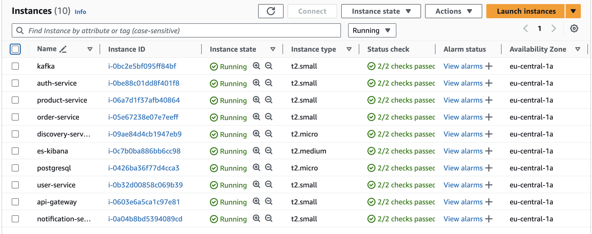
   
4. Key Pair - I selected the same for all instances - tier-service
5. Security Groups:
   
discovery-service:
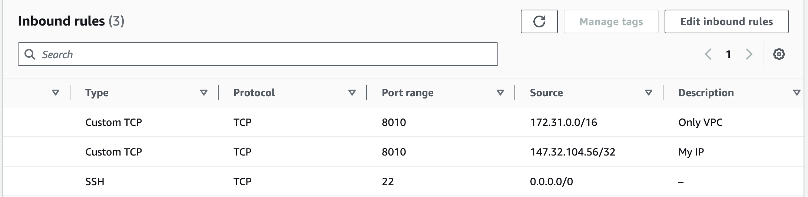

api-gateway:
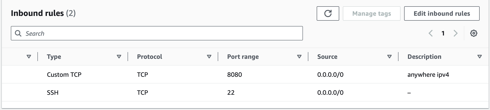

postgresql:
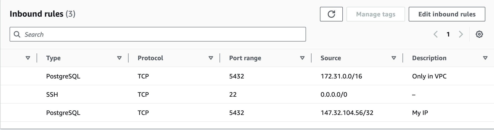

auth-service:

  
user-service:


kafka:
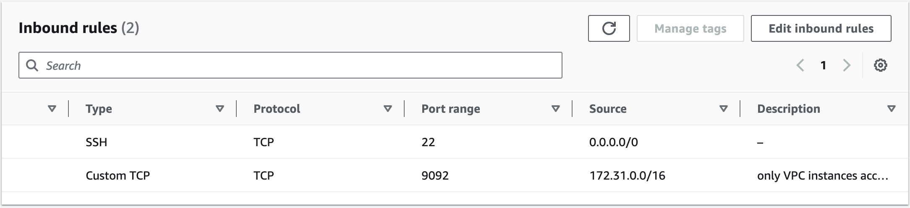

product-service:


order-service:
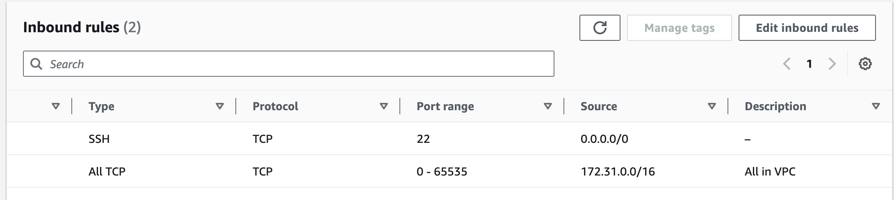

notification-service:


es-kibana:
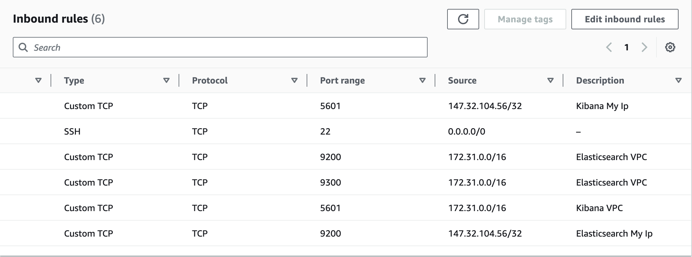

Install docker on EC2 instance:

```bash
sudo yum update && \
sudo yum install docker -y && \
sudo service docker start && \
sudo usermod -a -G docker ec2-user && \
exit
```

6. Also I have allocated Static IPs for curtain EC2's:
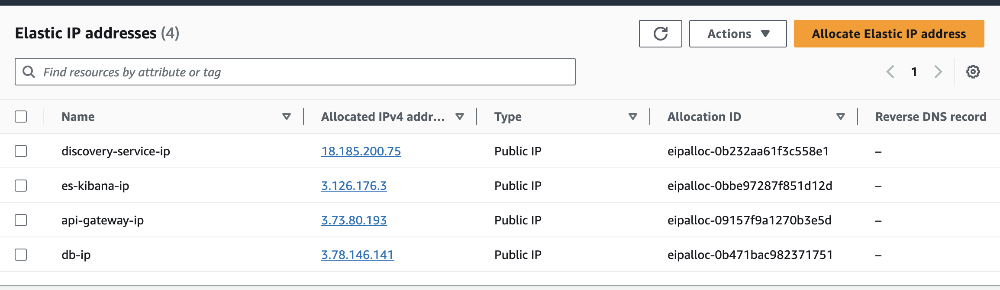


## Building and running docker containers on EC2

1. Discovery Service:
Build image:
```bash
docker buildx build --platform linux/amd64 -t aivazart/discovery-service:2.1 --force-rm=true . && docker push aivazart/discovery-service:2.1
```
Run container in production mode:
```bash
docker run -d —name discovery-service -p 8010:8010 -e "SPRING_PROFILES_ACTIVE=production" aivazart/discovery-service:2.1
```
2. Elasticsearch Kibana:
Create elastic network for communication between containers by their names:
```bash
docker network create elastic
```
Run setup container for setting up the elasticserch and kibana environment (creation of certificates). After successfull run of the Elasticsearch this container will stop:
```bash
docker run --name setup --net elastic --rm -v certs:/usr/share/elasticsearch/config/certs -e "ELASTIC_PASSWORD=elasticsearch1" -e "KIBANA_PASSWORD=kibana1" -e "STACK_VERSION=8.7.1" -e "CLUSTER_NAME=docker-cluster" --user 0 docker.elastic.co/elasticsearch/elasticsearch:8.7.1 bash -c '
  if [ ! -f config/certs/ca.zip ]; then
    echo "Creating CA";
    bin/elasticsearch-certutil ca --silent --pem -out config/certs/ca.zip;
    unzip config/certs/ca.zip -d config/certs;
  fi;
  if [ ! -f config/certs/certs.zip ]; then
    echo "Creating certs";
    echo -ne \
    "instances:\n"\
    "  - name: es01\n"\
    "    dns:\n"\
    "      - es01\n"\
    "      - localhost\n"\
    "      - 172.31.21.106\n"\
    "    ip:\n"\
    "      - 127.0.0.1\n"\
    "      - 172.31.21.106\n"\
    "  - name: kibana\n"\
    "    dns:\n"\
    "      - kibana\n"\
    "      - localhost\n"\
    "      - 172.31.21.106\n"\
    "    ip:\n"\
    "      - 127.0.0.1\n"\
    "      - 172.31.21.106\n"\
    > config/certs/instances.yml;
    bin/elasticsearch-certutil cert --silent --pem -out config/certs/certs.zip --in config/certs/instances.yml --ca-cert config/certs/ca/ca.crt --ca-key config/certs/ca/ca.key;
    unzip config/certs/certs.zip -d config/certs;
  fi;
  echo "Setting file permissions"
  chown -R root:root config/certs;
  find . -type d -exec chmod 750 \{\} \;;
  find . -type f -exec chmod 640 \{\} \;;
  echo "Waiting for Elasticsearch availability";
  until curl -s --cacert config/certs/ca/ca.crt https://es01:9200 | grep -q "missing authentication credentials"; do sleep 5; done;
  echo "Setting kibana_system password";
  until curl -s -X POST --cacert config/certs/ca/ca.crt -u "elastic:${ELASTIC_PASSWORD}" -H "Content-Type: application/json" https://es01:9200/_security/user/kibana_system/_password -d "{\"password\":\"${KIBANA_PASSWORD}\"}" | grep -q "^{}"; do sleep 5; done;
  echo "All done!";
'
```
Elasticsearch container:
```bash
docker run -d --name es01 --net elastic -v certs:/usr/share/elasticsearch/config/certs -v esdata01:/usr/share/elasticsearch/data -e "node.name=es01" -e "cluster.name=docker-cluster" -e "discovery.type=single-node" -e "ELASTIC_PASSWORD=elasticsearch1" -e "bootstrap.memory_lock=true" -e "xpack.security.enabled=true" -e "xpack.security.http.ssl.enabled=true" -e "xpack.security.http.ssl.key=certs/es01/es01.key" -e "xpack.security.http.ssl.certificate=certs/es01/es01.crt" -e "xpack.security.http.ssl.certificate_authorities=certs/ca/ca.crt" -e "xpack.security.transport.ssl.enabled=true" -e "xpack.security.transport.ssl.key=certs/es01/es01.key" -e "xpack.security.transport.ssl.certificate=certs/es01/es01.crt" -e "xpack.security.transport.ssl.certificate_authorities=certs/ca/ca.crt" -e "xpack.security.transport.ssl.verification_mode=certificate" -e "xpack.license.self_generated.type=basic" -p 9200:9200 --ulimit memlock=-1:-1 docker.elastic.co/elasticsearch/elasticsearch:8.7.1
```
Kibana container:
```bash
docker run -d --name kibana --net elastic -v certs:/usr/share/kibana/config/certs -v kibanadata:/usr/share/kibana/data -e "SERVERNAME=kibana" -e "ELASTICSEARCH_HOSTS=https://es01:9200" -e "ELASTICSEARCH_USERNAME=kibana_system" -e "ELASTICSEARCH_PASSWORD=kibana1" -e "ELASTICSEARCH_SSL_CERTIFICATEAUTHORITIES=config/certs/ca/ca.crt" -e "XPACK_SECURITY_ENCRYPTIONKEY=e55337180158e77d16a5a881281584c74beec94ad7dd973c18dfd2eec75913f6" -e "XPACK_ENCRYPTEDSAVEDOBJECTS_ENCRYPTIONKEY=e55337180158e77d16a5a881281584c74beec94ad7dd973c18dfd2eec75913f6" -e "XPACK_REPORTING_ENCRYPTIONKEY=e55337180158e77d16a5a881281584c74beec94ad7dd973c18dfd2eec75913f6" -p 5601:5601 docker.elastic.co/kibana/kibana:8.7.1
```
3. Api Gateway:
Build image:
```bash
docker buildx build --platform linux/amd64 -t aivazart/api-gateway:2.0 --force-rm=true . && docker push aivazart/api-gateway:2.0
```
Run container in production mode:
```bash
docker run -d —name api-gateway -p 8080:8080 -e "SPRING_PROFILES_ACTIVE=production" -v /api-logs:/api-logs aivazart/api-gateway:2.0
```
4. Postgresql Database:
Choose a directory on the EC2 host to store the PostgreSQL data. For example, let's use /var/lib/postgresql/data.

Create dir on host to persist data:
```bash
sudo mkdir -p /var/lib/postgresql/data
sudo chown 999:999 /var/lib/postgresql/data
sudo chmod -R 700 /var/lib/postgresql/data
```

Create .sql script for database creation:
```bash
touch /scripts/init-db.sql
sudo chmod 644 /scripts/init-db.sql
sudo chown 999:999 /scripts/init-db.sql
```

Run container and execute script:
```bash
docker run -d \
  --name eshop-db \
  -e POSTGRES_DB=eshop \
  -e POSTGRES_USER=admin \
  -e POSTGRES_PASSWORD=strong-production-password \
  -e PGDATA=/var/lib/postgresql/data/pgdata \
  -p 5432:5432 \
  -v /var/lib/postgresql/data:/var/lib/postgresql/data \
  -v /scripts:/docker-entrypoint-initdb.d \
  postgres:15
```
5. User Service:

Build image in production mode:
```bash
docker buildx build --platform linux/amd64 -t aivazart/user-service:2.4 —force-rm=true -f Dockerfile-production . && docker push aivazart/user-service:2.4
```
Run container in production mode and execute script for admin insertion (inside container logic, vz Dockerfile-production in user-service):
```bash
docker buildx build --platform linux/amd64 -t aivazart/user-service:2.4 —force-rm=true -f Dockerfile-production . && docker push aivazart/user-service:2.4
```
6. Auth Service:

Build image:
```bash
docker buildx build --platform linux/amd64 -t aivazart/auth-service:2.0 --force-rm=true . && docker push aivazart/auth-service:2.0
```
Run container in production mode:
```bash
docker run -d \
  --name auth-service \
  --env SPRING_PROFILES_ACTIVE=production \
  -v /api-logs:/api-logs \
  aivazart/auth-service:2.0
```
7. Kafka:
Create docker network kafka-network for container communication by their names:
```bash
docker network create kafka-network
```
Run Zookeeper:
```bash
docker run -d \
  --name zookeeper \
  --network kafka-network \
  -p 2181:2181 \
  -e ZOOKEEPER_CLIENT_PORT=2181 \
  -e ZOOKEEPER_TICK_TIME=2000 \
  confluentinc/cp-zookeeper:7.0.1
```

Run Kafka Broker:
```bash
docker run -d \
  --name broker \
  --network kafka-network \
  -p 9092:9092 \
  -e KAFKA_BROKER_ID=1 \
  -e KAFKA_ZOOKEEPER_CONNECT=zookeeper:2181 \
  -e KAFKA_LISTENER_SECURITY_PROTOCOL_MAP=PLAINTEXT:PLAINTEXT,PLAINTEXT_INTERNAL:PLAINTEXT \
  -e KAFKA_ADVERTISED_LISTENERS=PLAINTEXT://172.31.20.187:9092,PLAINTEXT_INTERNAL://broker:29092 \
  -e KAFKA_OFFSETS_TOPIC_REPLICATION_FACTOR=1 \
  -e KAFKA_TRANSACTION_STATE_LOG_MIN_ISR=1 \
  -e KAFKA_TRANSACTION_STATE_LOG_REPLICATION_FACTOR=1 \
  confluentinc/cp-kafka:7.0.1
```
8. Product Service:

Build image:
```bash
docker buildx build --platform linux/amd64 -t aivazart/product-service:2.1 —force-rm=true . && docker push aivazart/product-service:2.1
```

Run container in production mode:
```bash
docker run -d \
  --name product-service \
  --env SPRING_PROFILES_ACTIVE=production \
  -v /api-logs:/api-logs \
  aivazart/product-service:2.1
```
9. Order Service:
Build image:
```bash
docker buildx build --platform linux/amd64 -t aivazart/order-service:2.0 --force-rm=true . && docker push aivazart/order-service:2.1
```
Run container in production mode:
```bash
docker run -d \
  --name order-service \
  --env SPRING_PROFILES_ACTIVE=production \
  -v /api-logs:/api-logs \
  aivazart/order-service:2.1
```
10.  Notification Service:
Build image:
```
docker buildx build --platform linux/amd64 -t aivazart/notification-service:2.0 --force-rm=true . && docker push aivazart/notification-service:2.0
```
Run container in production mode:
```bash
docker run -d \
  --name notification-service \
  --env SPRING_PROFILES_ACTIVE=production \
  -v /api-logs:/api-logs \
  aivazart/notification-service:2.0
```


Example of running logstahs container for api-gateway. There is the same procedure for others EC2's:

1. Copy(create) logstash.conf to $(pwd)/logstash-production/api-gateway.
```bash
mkdir -p ~/logstash-production/api-gateway/
touch ~/logstash-production/api-gateway/logstash.conf
```
logstash.conf:
```bash
input {
  file {
    path => "/api-logs/api-gateway.log"
    tags => ["api-gateway-log"]
  }
}

output {
  if "api-gateway-log" in [tags] {
    elasticsearch {
      index => "api-gateway-%{+YYYY.MM.dd}"
      hosts => ["https://172.31.21.106:9200"]
      user=> "elastic"
      password=> "elasticsearch1"
      cacert=> "/usr/share/logstash/certs/ca/ca.crt"
    }
  }

  stdout { codec => rubydebug }
}
```
2. Copying certificates folder from Elasticsearch Kibana EC2 to Api Gateway EC2:
1. Connect to Elasticsearch Kibana EC2:
```bash
ssh -i "tier-service.pem" ec2-user@ec2-3-126-176-3.eu-central-1.compute.amazonaws.com
``` 
3. Add .pem file to this EC2 using scp:
```bash
scp -i ~/Downloads/tier-service.pem ~/Downloads/tier-service.pem ec2-user@ec2-3-126-176-3.eu-central-1.compute.amazonaws.com:/home/ec2-user/.ssh/
```
4. Ensure the correct permissions:
```bash
chmod 400 /home/ec2-user/.ssh/tier-service.pem
```
5. On the es-kibana EC2 instance, copy the certs directory to the Api-gateway EC2 instance:
```bash
sudo scp -i /home/ec2-user/.ssh/tier-service.pem -r /var/lib/docker/volumes/certs/_data ec2-user@ec2-3-120-247-140.eu-central-1.compute.amazonaws.com:/home/ec2-user/certs
```

Run logstash container:
```bash
docker run -d --name logstash  
-v /home/ec2-user/certs:/usr/share/logstash/certs 
-v /api-logs:/api-logs 
-v /home/ec2-user/logstash-production/api-gateway/logstash.conf:/usr/share/logstash/pipeline/logstash.conf:ro 
-e "xpack.monitoring.enabled=false" 
-e "ELASTIC_USER=elastic" 
-e "ELASTIC_PASSWORD=elasticsearch1" 
-e "ELASTIC_HOSTS=https://172.31.21.106:9200" 
docker.elastic.co/logstash/logstash:8.7.1
```

Cheack if it works:
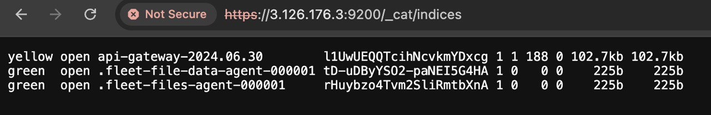
